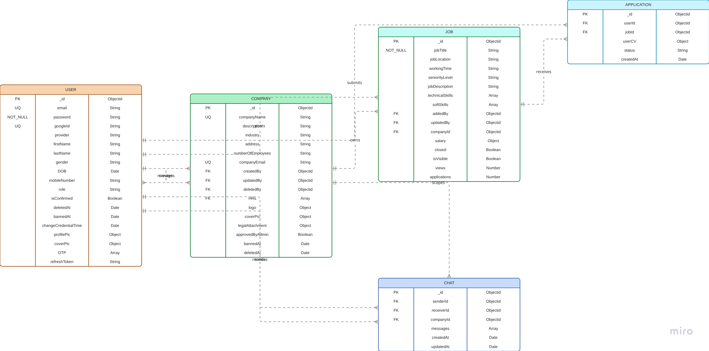

# Job Search App - Entity Relationship Diagram (ERD)

This document provides a comprehensive overview of the database schema for the Job Search App. The application uses **MongoDB** with **Mongoose** as the ODM, hosted on MongoDB Atlas.

## Database Schema Overview

The job search application consists of 5 core entities with hierarchical relationships, managed via Mongoose models with timestamps (`createdAt`, `updatedAt`).



## Key Relationships

### User & Company

- **One-to-Many**: A User can create multiple Companies (`createdBy` field).
- **Many-to-Many**: Multiple Users can be assigned as HR staff for a Company (`HRs` array).

### Recruitment Lifecycle

- **One-to-Many**: A Company can post multiple Jobs (`companyId` field)
- Jobs must be associated with an approved company

### Job-Application Relationship

- **One-to-Many**: A Job can receive multiple Applications (`jobId` field)
- **One-to-Many**: A User can submit multiple Applications (`userId` field)
- Unique constraint prevents duplicate applications

### Chat System

- **Bidirectional**: Users can chat with each other (`senderId`, `receiverId`)
- **Optional Company Context**: Chats can be linked to a company (`companyId`)

## Database Connection

**Provider**: MongoDB Atlas

**Connection String**: Configured via MONGODB_URL environment variable

**Connection Code** (`src/config/db.js`):

```javascript
const mongodb_url = process.env.MONGODB_URL;

const connectToDB = async () => {
  try {
    await mongoose.connect(`${mongodb_url}`);
    console.log(`Connected to DB`);
    startOTPCleanupJob();
  } catch (err) {
    console.log(`Database connection error: ${err.message}`);
    process.exit(1);
  }
};
```

## Features & Special Considerations

### Soft Deletes

- User, Company, Job use soft deletes with `deletedAt` timestamp
- Deleted records remain in database but are filtered out in queries

### Email Verification

- OTP codes stored in User.OTP array
- Two OTP types: `confirmEmail`, `forgetPassword`
- Auto-cleanup job removes expired OTPs

### File Storage

- Uses Cloudinary for image and file storage
- Stores secure_url and public_id for management

### Security Features

- Passwords hashed with bcryptjs (10 rounds)
- Mobile numbers encrypted in database
- OAuth support (Google)
- JWT-based authentication
- `bannedAt` field for suspension

### Full-Text Search

- Job collection has text index on jobTitle, jobDescription, technicalSkills
- Weighted search: jobTitle (10) > technicalSkills (5) > jobDescription (1)

## Migration & Setup

### Initial Database Setup

- MongoDB Atlas cluster created
- Database name configured
- Collections created on first connection
- Indexes created automatically by Mongoose

### OTP Cleanup Job

- Automatic job runs to remove expired OTPs
- Configured in src/jobs/otp-cleanup.job.js
- Started on database connection

## Cascading Delete Operations

The system implements comprehensive cascading deletes to maintain data integrity:

1. **User Deletion**: Removes all applications and chats where user is sender/receiver
2. **Company Deletion**: Removes all jobs (which cascade to applications) and company chats
3. **Job Deletion**: Removes all associated applications
