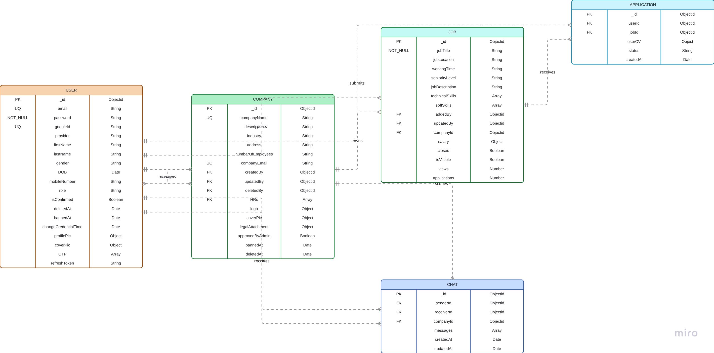

# Job Search App - Entity Relationship Diagram (ERD)

This document provides a comprehensive overview of the database schema for the Job Search App. The application uses **MongoDB** with **Mongoose** as the ODM, hosted on MongoDB Atlas.

## Database Schema Overview

The job search application consists of 5 core entities with hierarchical relationships, managed via Mongoose models with timestamps (`createdAt`, `updatedAt`).



## Key Relationships

### User & Company

- **One-to-Many**: A User can create multiple Companies (`createdBy` field).
- **Many-to-Many**: Multiple Users can be assigned as HR staff for a Company (`HRs` array).

### Recruitment Lifecycle

- **One-to-Many**: A Company can post multiple Jobs (`companyId` field)
- Jobs must be associated with an approved company

### Job-Application Relationship

- **One-to-Many**: A Job can receive multiple Applications (`jobId` field)
- **One-to-Many**: A User can submit multiple Applications (`userId` field)
- Unique constraint prevents duplicate applications

### Chat System

- **Bidirectional**: Users can chat with each other (`senderId`, `receiverId`)
- **Optional Company Context**: Chats can be linked to a company (`companyId`)

## Database Connection

**Provider**: MongoDB Atlas

**Connection String**: Configured via `MONGODB_URL` environment variable

**Connection Code** (`src/config/db.js`):

```javascript
const connectToDB = async () => {
  try {
    await mongoose.connect(process.env.MONGODB_URL);
    logger.info('Connected to DB');
  } catch (err) {
    logger.error(`Database connection error: ${err.message}`);
    process.exit(1);
  }
};
```

## Features & Special Considerations

### Soft Deletes

- User, Company, and Job use soft deletes with a `deletedAt` timestamp
- Deleted records remain in the database but are filtered out in queries

### Email Verification (OTP)

- OTP codes are generated, hashed, and stored in **Redis** (not in the User document)
- Redis keys follow the pattern: `otp:<type>:<email>` (e.g. `otp:confirmEmail:user@example.com`)
- Two OTP types: `confirmEmail`, `forgetPassword`
- TTL is set to **600 seconds (10 minutes)**: Redis automatically evicts expired OTPs
- Expired OTPs are cleaned up daily by the BullMQ **cleanup worker** (`src/jobs/cleanup.worker.js`)

### File Storage

- Uses Cloudinary for image and file storage
- Stores `secure_url` and `public_id` for future management (delete, replace)
- Images: profile photo, cover photo, company logo, company cover
- PDFs: applicant CV (uploaded during job application)

### Security Features

- Passwords hashed with bcryptjs (10 rounds)
- Mobile numbers encrypted in database using AES-256-CBC
- OAuth support (Google) via Passport.js
- JWT-based authentication (access + refresh tokens)
- `bannedAt` field for account suspension

### Full-Text Search

- Job collection has a text index on `jobTitle`, `jobDescription`, `technicalSkills`
- Weighted scoring: `jobTitle` (10) > `technicalSkills` (5) > `jobDescription` (1)

## Migration & Setup

### Initial Database Setup

- MongoDB Atlas cluster created
- Database name configured via environment variable
- Collections created automatically on first connection
- Indexes created automatically by Mongoose schema definitions

### OTP Expiry & Cleanup

OTP lifecycle is managed entirely through Redis TTL and a scheduled BullMQ job:

| Mechanism          | What it does                                                                            |
| ------------------ | --------------------------------------------------------------------------------------- |
| **Redis TTL**      | Automatically evicts OTP keys after 600 seconds (10 minutes)                            |
| **Cleanup worker** | `src/jobs/cleanup.worker.js`: runs daily, removes stale job listings older than 30 days |

Note: There is no separate `otp-cleanup.job.js`, as OTP expiry is handled natively by Redis.

## Cascading Delete Operations

The system implements comprehensive cascading deletes to maintain data integrity:

1. **User Deletion**: Removes all applications and chats where the user is sender or receiver
2. **Company Deletion**: Removes all jobs (which cascade to applications) and company chats
3. **Job Deletion**: Removes all associated applications
