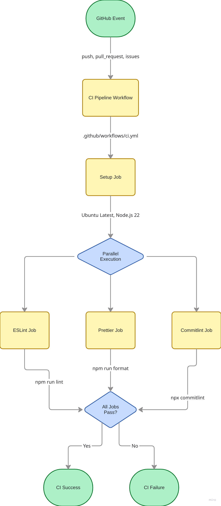
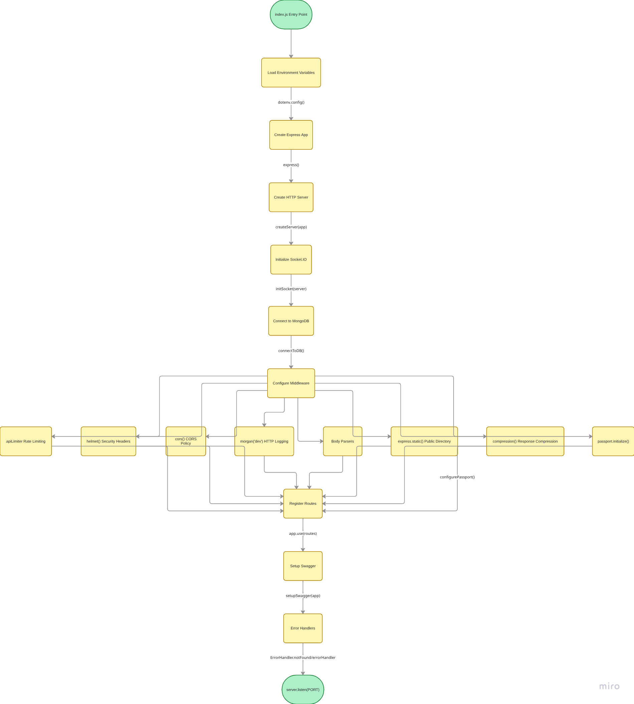

# Project Architecture Documentation

## Technology Stack

### Core Technologies

- **Runtime**: Node.js (22+), Express.js
- **Database**: MongoDB, Mongoose
- **Real-time**: Socket.IO
- **GraphQL**
- **Authentication**: Passport.js and JWT

### Key Dependencies

- **Security**: Helmet, bcrypt, jsonwebtoken
- **File Storage**: Cloudinary, Multer
- **Communication**: Nodemailer, Twilio, Telnyx
- **Validation**: Joi
- **Documentation**: Swagger UI Express
- **Data Export**: ExcelJS

## Build Tools & Scripts

### NPM Scripts

| Script          | Command                      | Purpose                      |
| --------------- | ---------------------------- | ---------------------------- |
| `start`         | `node ./src/index.js`        | Production server            |
| `start:dev`     | `nodemon ./src/index.js`     | Development with auto-reload |
| `format`        | `prettier --write "**/*.js"` | Code formatting              |
| `lint`          | `eslint "**/*.js" --fix`     | Code linting and fixes       |
| `test`          | `jest`                       | Run test suite               |
| `test:watch`    | `jest --watchAll`            | Continuous testing           |
| `test:coverage` | `jest --coverage`            | Coverage reports             |
| `prepare`       | `husky install`              | Install git hooks            |

### Development Tools

- **Nodemon** - Auto-restart during development
- **ESLint** - Code linting with custom rules
- **Prettier** - Code formatting
- **Husky** - Git hooks for pre-commit checks
- **Commitlint** - Commit message validation
- **Jest** - Testing framework with Babel support

## CI/CD Pipeline

### GitHub Actions Workflow

The project uses GitHub Actions with parallel job execution:



### Pipeline Jobs

1. **Setup Job** - Installs dependencies (required by all jobs)
2. **ESLint Job** - Validates code quality
3. **Prettier Job** - Validates code formatting
4. **Commitlint Job** - Validates commit message format

## Project Architecture

### Server Initialization Flow



### Dependency Injection Pattern

The application uses a dependency injection container pattern in `src/container.js`:

```javascript
// DAOs (Data Access Objects)
const userRepository = new UserDAO();
const companyRepository = new CompanyDAO();
const jobRepository = new JobDao();
// ... other repositories

// Services
const authService = new AuthService(userRepository);
const userService = new UserService(userRepository);
// ... other services

// Controllers
const authController = new AuthController(authService);
const userController = new UserController(userService);
// ... other controllers
```

## API Architecture

### Key Features & Architecture Patterns

#### Design Patterns

- MVC (Model-View-Controller): Controllers handle requests, Services contain logic, Models define structure
- DAO (Data Access Object): Abstracts database operations
- Repository Pattern: DAOs act as repositories
- Dependency Injection: Container manages dependencies
- Middleware Pattern: Request/response pipeline
- Strategy Pattern: Multiple auth strategies (JWT, Google OAuth)

#### Security Features

- Password Hashing: bcryptjs with 10 rounds
- JWT Tokens: Access + Refresh tokens
- OAuth 2.0: Google authentication
- Encryption: Mobile numbers and sensitive data
- Rate Limiting: Prevent brute force attacks
- CORS: Cross-origin protection
- Helmet: Security headers
- Input Validation: Joi schemas

#### Real-time Features

- Socket.IO: Real-time chat messaging
- WebSocket Protocol: For live notifications
- Bidirectional Communication: Server-to-client updates

#### Data Persistence

- Soft Deletes: Records marked as deleted, not removed
- Cascade Deletes: Related records deleted automatically
- Timestamps: Created/updated tracking
- Indexes: Performance optimization

#### File Management

- Cloudinary: Cloud storage for images/files
- Multer: File upload handling
- Streaming: Efficient file transfer
- Type Validation: PDF, image formats

### Three API Interfaces

1. **RESTful HTTP API**

   - Base paths: `/api/v1/` and `/api/auth/`
   - Authentication: Bearer JWT tokens
   - Documentation: OpenAPI 3.0 at `/api-docs`
   - Rate limiting applied globally

2. **GraphQL API**

   - Endpoint: `/graphql`
   - Apollo Server implementation
   - Type-safe queries and mutations

3. **WebSocket API (Socket.IO)**
   - Real-time communication
   - JWT authentication during handshake
   - Event namespaces for notifications and chat

### Route Structure

```javascript
// Route registration in src/routes/index.routes.js
router.use('/api', authRouter); // Authentication
router.use('/api/v1', userRouter); // User management
router.use('/api/v1', adminRouter); // Admin functions
router.use('/api/v1', companyRouter); // Company operations
router.use('/api/v1', jobRouter); // Job postings
router.use('/api/v1', applicationRouter); // Applications
router.use('/api/v1', chatRouter); // Real-time chat
```

### Rate Limiting

- Default: 15 requests per 15 minutes per IP
- Applied to: All API routes
- Exceptions: Static files, health checks (configurable)

## Code Quality & Standards

### ESLint Configuration

- Uses `@eslint/js` recommended rules
- Enforces semicolons, no-console warnings, prefer-const
- Ignores build directories and tests

### Pre-commit Quality Checks

Husky runs pre-commit hooks via lint-staged:

1. ESLint with auto-fix
2. Prettier formatting
3. Commitlint validation

### Development Workflow

Follows GitHub Flow with conventional commits:

1. Create issue with type prefix: `[FEATURE]`, `[FIX]`, etc.
2. Create branch: `feature/123/description`
3. Commit with conventional format: `feat: implement feature`
4. Create pull request
5. Code review
6. Merge and cleanup
