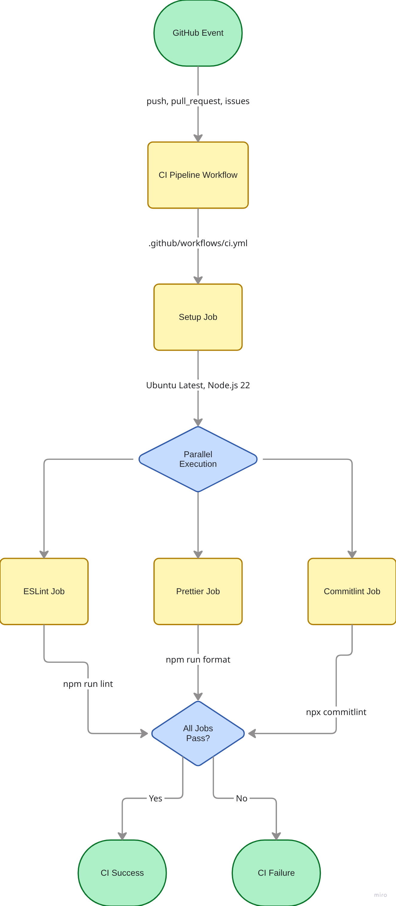
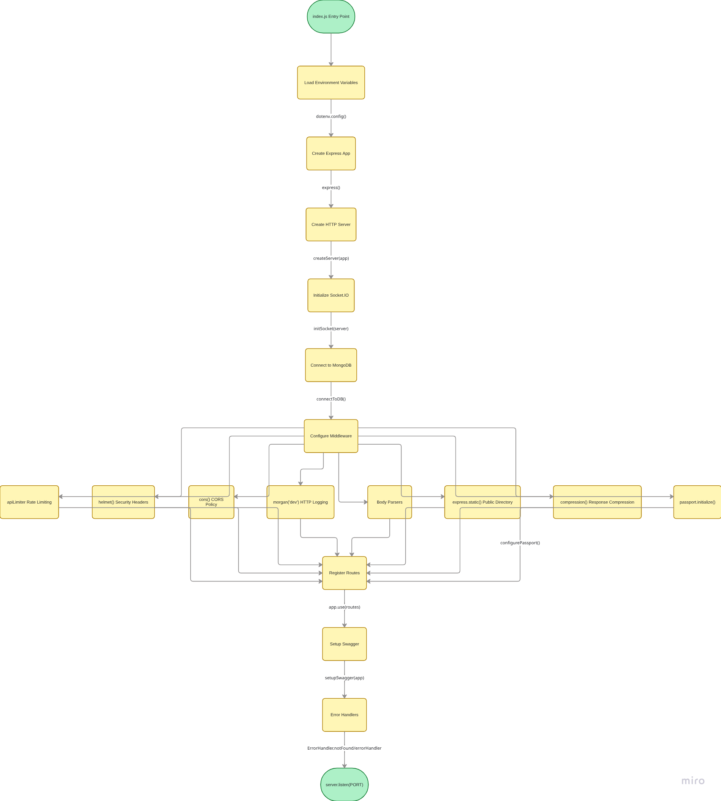

# Project Architecture Documentation

## Technology Stack

### Core Technologies

- **Runtime**: Node.js (22+), Express.js
- **Database**: MongoDB, Mongoose
- **Cache & Queue Backend**: Redis (ioredis)
- **Real-time**: Socket.IO + Redis adapter
- **Background Jobs**: BullMQ
- **GraphQL**: express-graphql
- **Authentication**: Passport.js and JWT

### Key Dependencies

- **Security**: Helmet, bcryptjs, jsonwebtoken
- **File Storage**: Cloudinary, Multer
- **Email**: Nodemailer (via BullMQ email queue)
- **Validation**: Joi
- **Documentation**: Swagger UI Express, express-jsdoc-swagger
- **Data Export**: ExcelJS
- **Logging**: Winston

## Build Tools & Scripts

### NPM Scripts

| Script             | Command                                                         | Purpose                      |
| ------------------ | --------------------------------------------------------------- | ---------------------------- |
| `start`            | `node ./src/index.js`                                           | Production server            |
| `start:dev`        | `nodemon ./src/index.js`                                        | Development with auto-reload |
| `format`           | `prettier --write "**/*.js"`                                    | Format all JS files          |
| `format:check`     | `prettier --check "**/*.js"`                                    | Verify formatting (CI)       |
| `lint`             | `eslint .`                                                      | Run ESLint                   |
| `lint:fix`         | `eslint . --fix`                                                | Run ESLint with auto-fix     |
| `test`             | `jest`                                                          | Run all tests                |
| `test:unit`        | `jest --testPathPatterns="unit"`                                | Unit tests only              |
| `test:integration` | `jest --testPathPatterns="integration" --runInBand --forceExit` | Integration tests (serial)   |
| `test:watch`       | `jest --watchAll`                                               | Continuous testing           |
| `test:coverage`    | `jest --coverage`                                               | Coverage report              |
| `prepare`          | `husky`                                                         | Install git hooks            |

### Development Tools

- **Nodemon**: auto-restart during development
- **ESLint**: code linting with custom rules
- **Prettier**: code formatting
- **Husky**: git hooks for pre-commit checks
- **Jest**: testing framework with Babel support

## CI/CD Pipeline

### GitHub Actions Workflow

The project uses GitHub Actions with a multi-stage pipeline that runs on every pull request to `main`.



### Pipeline Jobs

All jobs after `setup` run in parallel (ESLint and Prettier), then unit and integration tests run sequentially.

| Job                  | Depends on                         | What it does                                     |
| -------------------- | ---------------------------------- | ------------------------------------------------ |
| **setup**            | —                                  | Installs dependencies (required by all jobs)     |
| **eslint**           | setup                              | Validates code quality                           |
| **prettier**         | setup                              | Validates code formatting                        |
| **unit-test**        | setup, eslint, prettier            | Runs unit tests with in-memory MongoDB           |
| **integration-test** | setup, eslint, prettier, unit-test | Runs integration tests with a real Redis service |

Integration tests run serially (`--runInBand`) to avoid race conditions between test suites.

## Project Architecture

### Server Initialization Flow



On startup, the server:

1. Creates an HTTP server and initializes Socket.IO (with Redis adapter)
2. Connects to MongoDB
3. Connects to Redis
4. Starts BullMQ workers (email, cleanup, report)
5. Begins listening for HTTP requests
6. Registers `SIGTERM`/`SIGINT` handlers for graceful shutdown

### Dependency Injection Pattern

The application uses a manual dependency injection container in `src/container.js`:

```javascript
// DAOs (Data Access Objects)
const userRepository = new UserDAO();
const companyRepository = new CompanyDAO();
const jobRepository = new JobDao();
// ... other repositories

// Services
const authService = new AuthService(userRepository);
const userService = new UserService(userRepository);
// ... other services

// Controllers
const authController = new AuthController(authService);
const userController = new UserController(userService);
// ... other controllers
```

## API Architecture

### Key Features & Architecture Patterns

#### Design Patterns

- **MVC**: Controllers handle requests, Services contain business logic, Models define structure
- **DAO (Data Access Object)**: Abstracts all database operations from business logic
- **Repository Pattern**: DAOs act as repositories
- **Dependency Injection**: Container in `src/container.js` wires all dependencies
- **Middleware Pipeline**: Request validation, auth, rate limiting, error handling
- **Strategy Pattern**: Multiple auth strategies (JWT, Google OAuth) via Passport

#### Security Features

- **Password Hashing**: bcryptjs with 10 rounds
- **JWT Tokens**: Access + Refresh token rotation
- **OAuth 2.0**: Google authentication via Passport
- **AES-256-CBC Encryption**: Applied to sensitive fields (e.g. mobile numbers)
- **Redis Rate Limiting**: Sliding window per route, hashed by user ID or IP
- **CORS**: Allowlisted origins only
- **Helmet**: Security headers
- **Input Validation**: Joi schemas on all incoming request bodies

#### Real-time Features

- **Socket.IO**: Real-time bidirectional messaging
- **Redis adapter**: Horizontal scaling across multiple Node.js instances
- **JWT handshake**: Authentication at WebSocket connection time
- **Typing indicators**: `userTyping` / `userStoppedTyping` events

#### Background Jobs (BullMQ)

Three workers backed by Redis:

| Worker      | Queue          | What it does                                                      |
| ----------- | -------------- | ----------------------------------------------------------------- |
| **email**   | `emails`       | Sends OTP, acceptance, and rejection emails via Nodemailer        |
| **cleanup** | `cleanup-jobs` | Runs daily, deletes closed/invisible jobs older than 30 days      |
| **report**  | `report-jobs`  | Runs weekly, generates Excel reports and emails them to companies |

All workers support retry with exponential backoff.

#### Data Persistence

- **Soft Deletes**: User, Company, and Job records are marked with `deletedAt`, not removed
- **Cascade Deletes**: User deletion removes related applications and chats; company deletion removes jobs and applications
- **Timestamps**: `createdAt` / `updatedAt` on all collections
- **Indexes**: Full-text index on Job (`jobTitle`, `technicalSkills`, `jobDescription`) with weighted scoring

#### File Management

- **Cloudinary**: Cloud storage for images (profile/cover pics, company logo/cover) and PDFs (CVs)
- **Multer**: In-memory file handling before Cloudinary upload
- **Type Validation**: Images only for photos; PDF only for CVs

### Three API Interfaces

1. **RESTful HTTP API**

   - Base paths: `/api/v1/` and `/api/auth/`
   - Authentication: Bearer JWT tokens
   - Documentation: OpenAPI 3.0 at `/api-docs`
   - Rate limiting: 100 req/60s on `/api/v1/`, 10 req/60s on `/api/auth/`

2. **GraphQL API**

   - Endpoint: `/graphql`
   - Library: `express-graphql`
   - Access: Admin only (`verifyAdminPermission` middleware)
   - Queries: `getAllUsers`, `getAllCompanies`, `getAllData`
   - Rate limiting: 20 req/60s

3. **WebSocket API (Socket.IO)**
   - Real-time messaging and notifications
   - JWT authentication during handshake
   - Redis adapter for horizontal scaling
   - Supported events: `sendMessage`, `typing`, `stopTyping`, `getJobApplicants`, `getCompanyJobs`, `getMyApplications`

### Route Structure

```javascript
// Route registration in src/routes/index.js
router.use('/api', authRouter); // Authentication (public)
router.use('/api/v1', v1Limiter, verifyToken, userRouter);
router.use('/api/v1', v1Limiter, verifyToken, adminRouter);
router.use('/api/v1', v1Limiter, verifyToken, companyRouter);
router.use('/api/v1', v1Limiter, verifyToken, jobRouter);
router.use('/api/v1', v1Limiter, verifyToken, applicationRouter);
router.use('/api/v1', v1Limiter, verifyToken, chatRouter);
router.use('/graphql', graphqlLimiter, verifyToken, graphqlRouter);
```

## Code Quality & Standards

### ESLint Configuration

- Uses `@eslint/js` recommended rules
- Enforces semicolons, no-console warnings, prefer-const
- Ignores build directories and test output

### Pre-commit Quality Checks

Husky runs pre-commit hooks:

1. ESLint with auto-fix
2. Prettier formatting

### Development Workflow

Follows GitHub Flow with conventional commits:

1. Create issue with type prefix: `[FEATURE]`, `[FIX]`, etc.
2. Create branch: `feat/123/description` or `fix/description`
3. Commit with conventional format: `feat: implement feature`
4. Create pull request
5. Code review
6. Merge and cleanup
